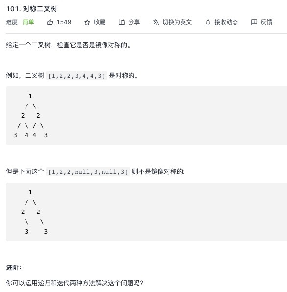

<https://leetcode-cn.com/problems/symmetric-tree/>

## 1.常规解法

```js
/**
 * Definition for a binary tree node.
 * function TreeNode(val, left, right) {
 *     this.val = (val===undefined ? 0 : val)
 *     this.left = (left===undefined ? null : left)
 *     this.right = (right===undefined ? null : right)
 * }
 */
/**
 * @param {TreeNode} root
 * @return {boolean}
 */
var isSymmetric = function(root) {
    return isSameNode(root.left, root.right)
};
function isSameNode(p, q){
    if (p && q) {
        if (p.val === q.val) {
            return isSameNode(p.left, q.right) && isSameNode(p.right, q.left)
        }else{
            return false
        }
    } else if ((p && !q) || (!p && q)) {
        return false
    } else {
        return true
    }
}
```
