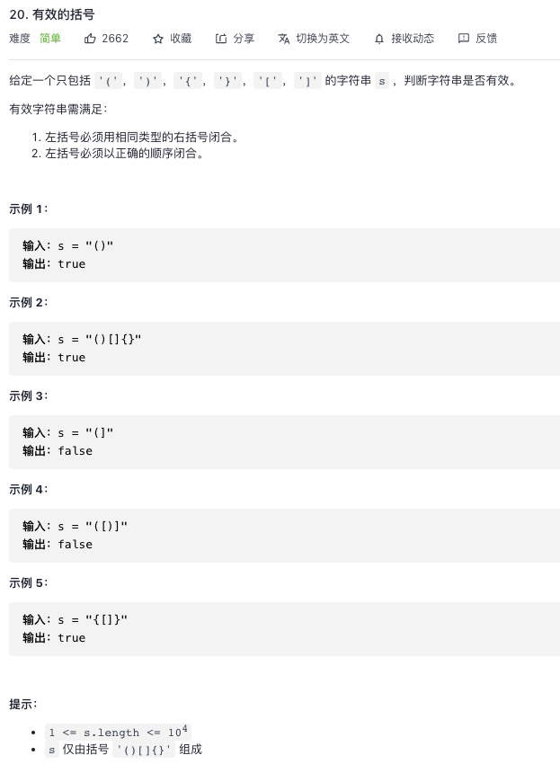

<https://leetcode-cn.com/problems/valid-parentheses/>


## 1.常规解法

```js
let isValid = function(s) {
    let sObj = {
        ')': '(',
        ']': '[',
        '}': '{'
    }
    let record = []
    for(let i = 0; i < s.length; i++){
        // 是否是反括号
        if(s[i] in sObj){
            // 上一个正括号是否匹配反括号
            if(sObj[s[i]] === record.pop()){
                continue
            }
            else{
                return false
            }
        }
        // 正括号加入
        record.push(s[i])
    }
    return record.length === 0
};
```
