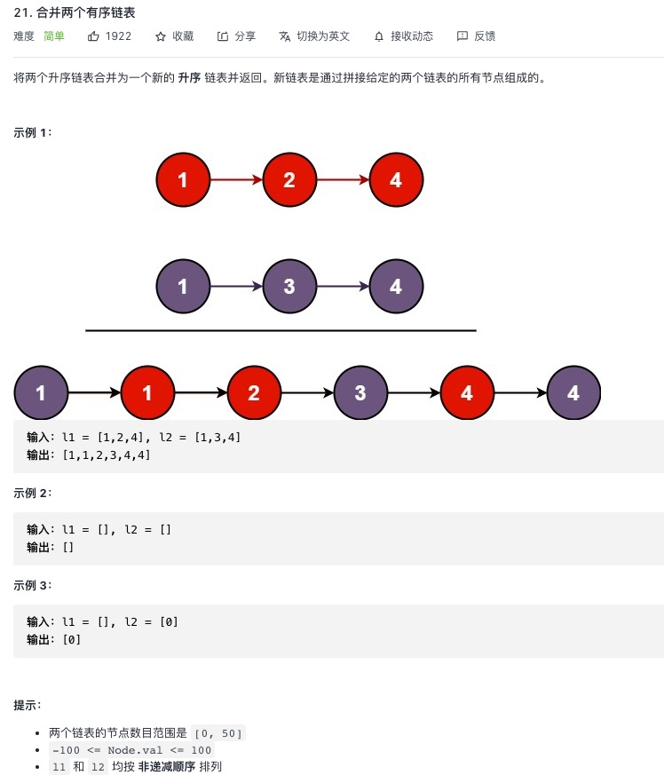

<https://leetcode-cn.com/problems/merge-two-sorted-lists/>


## 1.常规解法

```js
/**
 * Definition for singly-linked list.
 * function ListNode(val, next) {
 *     this.val = (val===undefined ? 0 : val)
 *     this.next = (next===undefined ? null : next)
 * }
 */
/**
 * @param {ListNode} l1
 * @param {ListNode} l2
 * @return {ListNode}
 */
//[1,2,4,5,6]
//[1,3,4]
var mergeTwoLists = function(l1, l2) {
    if(!l1){
        return l2
    }
    if(!l2){
        return l1
    }
    let newListNode = new ListNode(-1)
    let prev = newListNode
    while(l1 && l2){
        if(l1.val <= l2.val){
            prev.next = l1
            l1 = l1.next;
        }
        else{
            prev.next = l2
            l2 = l2.next;
        }
        // [-1,1,2,4,5,6]
        // [1,1,3,4]
        // [1,2,4,5,6]
        // [2,3,4]
        // [3,4,5,6]
        // [4,4]
        prev = prev.next
    }
    // 当某一个走完，另一个直接拼接即可
    prev.next = l1 ? l1 : l2
    return newListNode.next
};
```
