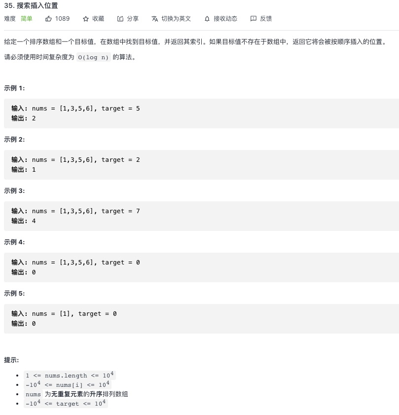

<https://leetcode-cn.com/problems/search-insert-position/>


## 1.递归解法

```js
let searchInsert = function (nums, target) {
    return searchSplit(nums, 0, nums.length - 1, target)
}
let searchSplit = function (nums, left, right, target) {
    if (left === right) {
        return nums[left] < target ? left + 1 : left
    }
    let middle = left + ((right - left) >> 1) // 等于l+(r-l)/2
    if (nums[middle] >= target) {
        return searchSplit(nums, left, middle, target)
    }
    else {
        return searchSplit(nums, middle + 1, right, target)
    }
};
```
## 2.循环解法

```js
let searchInsert = function (nums, target) {
    let middle = 0
    let left = 0
    let right = nums.length - 1
    while (left < right) {
        middle = left + ((right - left) >> 1) // 等于l+(r-l)/2
        if (nums[middle] >= target) {
            right = middle
        }
        else {
            left = middle + 1
        }
    }
    return nums[left] < target ? left + 1 : left
}
```