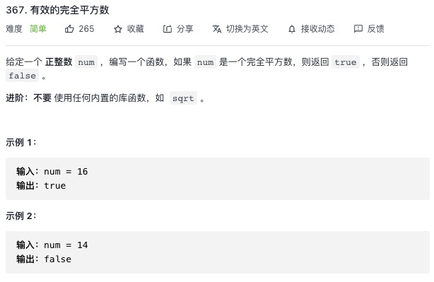

<https://leetcode-cn.com/problems/valid-perfect-square/>


## 1.常规解法

```js
let isPerfectSquare = function (num) {
    const x = Math.floor(Math.sqrt(num));
    return x * x === num;
}
```
## 2.进阶

```js
let isPerfectSquare = function (num) {
    let left = 0
    let right = num
    while(left <= right){
        const mid = left + ((right - left) >> 1)
        const square = mid * mid;
        if(square === num){
            return true
        }else if(square > num){
            right = mid - 1
        }else{
            left = mid + 1
        }
    }
    return false
};
```