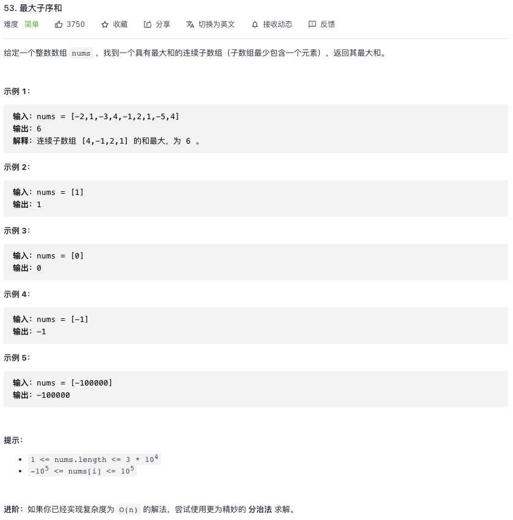

<https://leetcode-cn.com/problems/maximum-subarray/>


## 1.常规解法
持续记录当前最大值，相加小于后续的值，直接取后续值的值
```js
let maxSubArray = function(nums) {
    if(nums.length === 0){
        return nums[0]
    }
    let max  = nums[0]
    let sum = nums[0]
    let i = 1
    while(i < nums.length){
        if(nums[i] > sum + nums[i]){
            sum = nums[i]
        }
        else{
            sum = sum + nums[i]
        }
        max = Math.max(sum, max)
        i++
    }
    return max
};
```