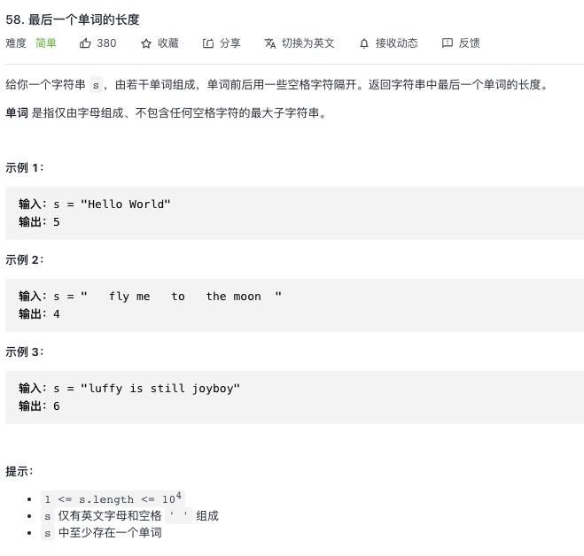

<https://leetcode-cn.com/problems/length-of-last-word/>


## 1.常规解法
```js
let lengthOfLastWord = function (s) {
    // s = s.trimEnd()
    let result = 0
    let len = s.length - 1
    // 倒叙清除空格
    while(s[len] == ' '){
        len--;
    }
    while (len >= 0) {
        if (s[len] === ' ') {
            break
        }
        result++
        len--
    }
    return result
};
```