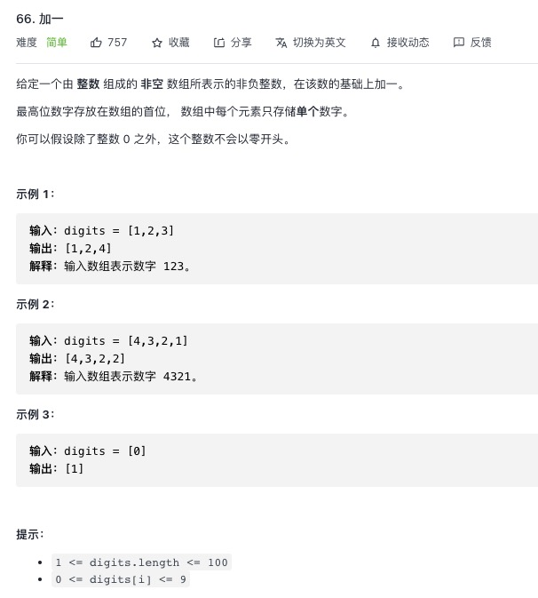

<https://leetcode-cn.com/problems/plus-one/>

## 1.常规解法
```js
let plusOne = function(digits) {
    for (let i = digits.length - 1; i >= 0; i--) {
        digits[i]++
        digits[i] = digits[i] % 10
        if (digits[i]) return digits
    }
    // 循环完代表第一项也为10
    digits.unshift(1)
    return digits
};
```