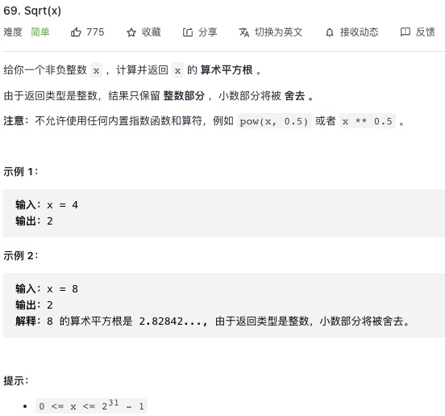

<https://leetcode-cn.com/problems/sqrtx/>

## 1.采用二分法
```js
let mySqrt = function(x) {
    //采用二分法
    let left = 0
    let right = x
    let mid = 0
    let result = 0
    while(left <= right){
        mid = left + ((right - left) >> 1)
        if(mid * mid <= x){
            left = mid + 1
            result = mid
        }else{
            right = mid - 1
        }
    }
    return result
};
```
