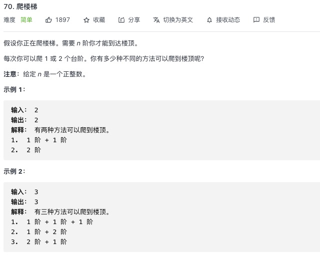

<https://leetcode-cn.com/problems/climbing-stairs/>

n 层的楼梯只有 2 中可能上去，1 步或者 2 步，所以等于 n-1 + n-2 的方法
## 1.常规解法
```js
let climbStairs = function (n) {
    let dp = []
    dp[1] = 1 // 1层楼梯只有1种可能
    dp[2] = 2 // 2层楼梯只有2种可能
    // 第三层是1的可能+2的可能  第四层是 2的可能+3的可能 n = n-1的可能 + n-2的可能
    for (let i = 3; i <= n; i++) {
        dp[i] = dp[i - 1] + dp[i - 2]
    }
    return dp[n]
};
```