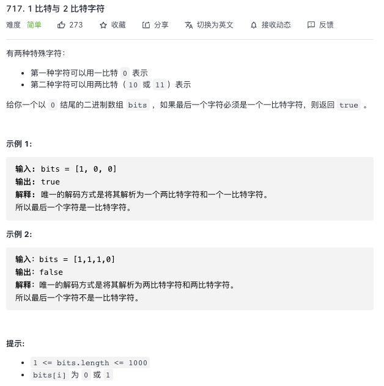

<https://leetcode-cn.com/problems/1-bit-and-2-bit-characters/>


思路：第一种字符一定以 00 开头，第二种字符一定以 11 开头，定义一个n从头到尾走，当遇到1的时候直接跳过，因为1后面的值必须和1凑对

```js
var isOneBitCharacter = function (bits) {
    let num = bits.length - 1
    let n = 0
    while (n < num) {
        if (bits[n] === 1) {
            n++
        }
        n++
    }
    return n === num
};
```
