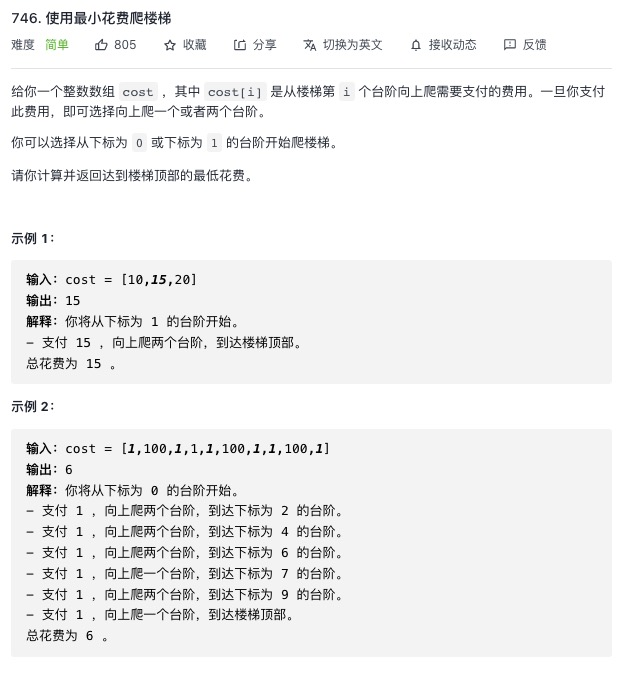

<https://leetcode-cn.com/problems/1-bit-and-2-bit-characters/>


思路：到达 n 格的时候花费肯定是 n-1 总额 + n-1 格子的花费 或者 n-2 总额 + n-2 格子的花费

```js
var minCostClimbingStairs = function(cost) {
	let dp = Array(cost.length + 1)
	dp[0] = 0
	dp[1] = 0
	for (let i = 2; i <= cost.length; i++) {
		dp[i] = Math.min(dp[i - 1] + cost[i - 1], dp[i - 2] + cost[i - 2])
	}
	return dp[cost.length]
}
```
