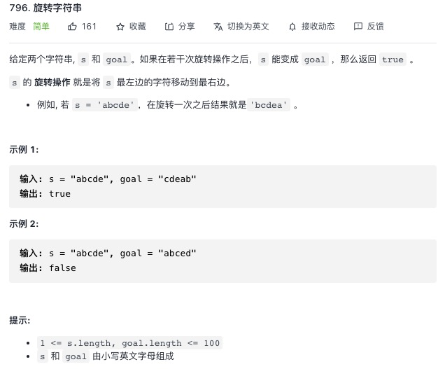

<https://leetcode-cn.com/problems/rotate-string/>


思路：当给定字符串拼接自己后，可以有旋转的所有可能，所有直接可以判定给定值是否在里面

```js
var rotateString = function (s, goal) {
    if(s.length !== goal.length){
        return false
    }
    let newS = s + s
    return newS.indexOf(goal) > -1
};
```
