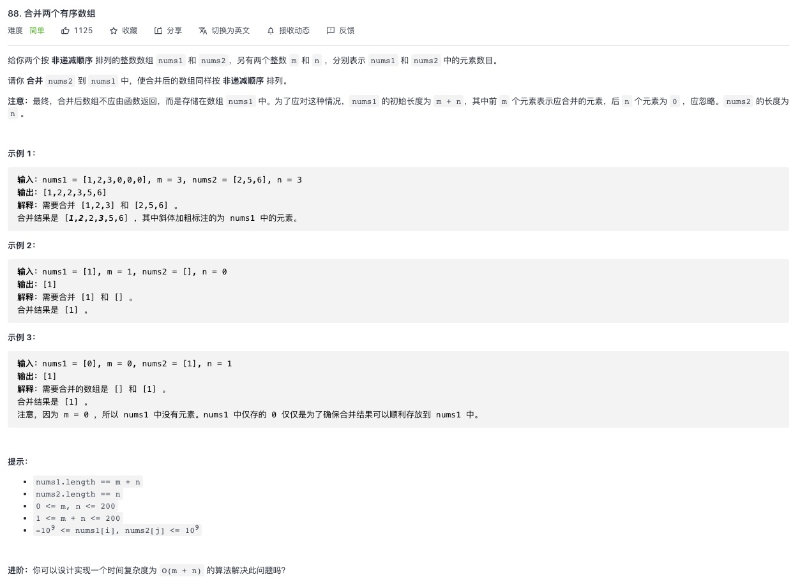

<https://leetcode-cn.com/problems/merge-sorted-array/>

## 1.直接用数组的排序解决
>时间复杂度：O((m+n)log(m+n))
>排序序列长度为 m+nm+n，套用快速排序的时间复杂度即可，平均情况为 O((m+n)log(m+n))

```js
let merge = function (nums1, m, nums2, n) {
    nums1.splice(m, n, ...nums2)
    nums1.sort((a, b) => a - b);
}
```
## 2.循环指针解决
>复杂度为 O(m + n)
```js
let merge = function (nums1, m, nums2, n) {
    let newArray = new Array(nums1.length).fill(0);
    let p = 0
    let i = 0
    let j = 0
    while (p < nums1.length) {
        if (i < m) {
            if (nums1[i] > nums2[j]) {
                newArray[p] = nums2[j]
                j++
            } else {
                newArray[p] = nums1[i]
                i++
            }
        } else {
            newArray[p] = nums2[j]
            j++
        }
        p++
    }
    for (let index = 0; index < nums1.length; index++) {
        nums1[index] = newArray[index];
    }
}
```