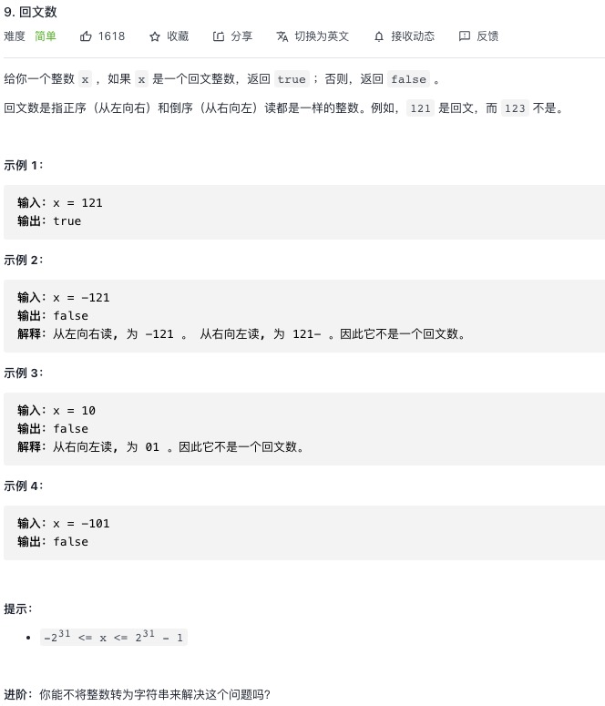

<https://leetcode-cn.com/problems/palindrome-number/>


## 1.常规解法
**思路：运用数字反转的方法计算出反转后的值**
```js
let isPalindrome = function(x) {
    if(x < 0){
        return false
    }
    // 运用数字反转的方法计算出反转后的值
    let result = 0
    let count = x 
    while(count > 0){
        result = result * 10 +  count % 10
        count = Math.trunc(count / 10)
    }
    return result === x 
}
```
